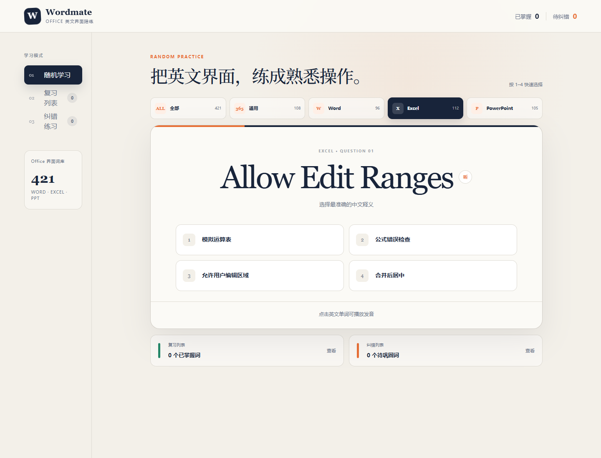

# Wordmate · Office 英文界面词汇陪练

一个帮助中文用户适应 Microsoft 365 英文工作环境的轻量词汇练习工具，聚焦 **Word、Excel 和 PowerPoint** 的真实界面术语。每题展示一个英文界面词与四个中文选项；答对后加入复习列表，答错后进入纠错列表。



## 功能特点

- **421 个高频界面词条**：通用 108、Word 96、Excel 112、PowerPoint 105。
- **按软件筛选**：可练习全部词条，也可单独选择通用、Word、Excel 或 PowerPoint。
- **贴近真实界面**：覆盖功能区、文件管理、排版、审阅、公式、数据、图表、动画和放映等场景。
- **四选一练习**：一个正确释义配三个干扰项，优先从同一软件分类中生成选项。
- **英文发音**：点击术语，通过浏览器 Web Speech API 播放发音。
- **复习与纠错闭环**：答对自动归入复习列表，答错自动进入纠错列表。
- **本地进度**：学习记录保存在当前浏览器的 `localStorage`，无需注册。
- **键盘操作**：支持数字键 `1`–`4` 快速作答。

## 词库范围

| 分类 | 词条数 | 主要内容 |
| --- | ---: | --- |
| 通用 Office | 108 | Ribbon、Tab、Save As、Paste Special、Options、Accessibility Checker 等 |
| Word | 96 | Styles、Margins、Section Break、Mail Merge、Track Changes、Table of Contents 等 |
| Excel | 112 | Formula Bar、AutoSum、Data Validation、PivotTable、Freeze Panes、Goal Seek 等 |
| PowerPoint | 105 | Slide Layout、Transitions、Animation Pane、Presenter View、Slide Master 等 |

词条参考当前 Microsoft 365 英文界面和微软官方帮助文档整理，包括 [Office 功能区](https://support.microsoft.com/en-us/office/customize-the-ribbon-in-office-00f24ca7-6021-48d3-9514-a31a460ecb31)、[Excel 快捷键与命令](https://support.microsoft.com/en-us/office/keyboard-shortcuts-in-excel-1798d9d5-842a-42b8-9c99-9b7213f0040f) 和 [PowerPoint 功能区说明](https://support.microsoft.com/en-us/powerpoint/where-are-the-menus-and-toolbars)。不同 Microsoft 365 版本、平台和账户可能显示略有差异。

## 技术实现

| 模块 | 技术 |
| --- | --- |
| 前端框架 | Next.js 16、React 19、TypeScript |
| 构建与运行 | Vinext、Vite 8、Cloudflare Workers 兼容输出 |
| 样式 | Tailwind CSS 4 + 原生 CSS |
| 发音 | Web Speech API（`speechSynthesis`） |
| 数据 | 本地 TSV 分类词库 |
| 状态持久化 | 浏览器 `localStorage` |
| 在线托管 | OpenAI Sites |

## 本地运行

需要 Node.js `>= 22.13.0` 和 npm `>= 10`。

```bash
git clone https://github.com/risievol2-alt/wordmate-cet4-study.git
cd wordmate-cet4-study
npm install
npm run dev
```

生产构建：

```bash
npm run build
npm run start
```

## 项目结构

```text
app/                  页面、交互与样式
public/office.tsv     Office 英文界面分类词库
docs/screenshot.png   项目截图
worker/               Cloudflare Worker 入口
.openai/hosting.json  Sites 托管配置
```

## 数据与隐私

- 学习记录仅保存在用户当前浏览器中。
- 项目不收集 Cookie、个人信息或学习记录。
- 仓库不包含生产数据库、环境变量、密钥或扫描报告。
- 本项目与 Microsoft 无隶属或背书关系，产品名称仅用于描述词汇适用场景。

## License

本项目代码采用 [MIT License](LICENSE) 开源。
